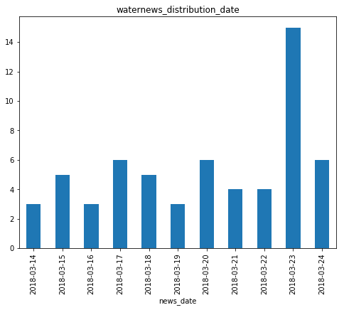

## 本文是抓取人民网水污染相关报道数据的简单代码。过程比较简单，还有很多需要优化

### 加载PYTHON包


```python
import urllib2
import requests
from bs4 import BeautifulSoup #适用于4.X版本
#from BeautifulSoup import BeautifulSoup
import sys
reload(sys).setdefaultencoding('gbk')
import json
global str
import re
import pandas as pd
import math
import csv
import codecs
import time
import datetime
import matplotlib.pyplot as plt
```

### 获取水污染报道数量


```python
page_url = 'http://search.people.com.cn/cnpeople/search.do?siteName=news&pageNum=1&keyword=%CB%AE%CE%DB%C8%BE&facetFlag=true&nodeType=belongsId&nodeId=0&pageCode=&originName='
print page_url
res = requests.get(page_url,timeout=None)
res.encoding = 'gbk'
# 使用剖析器为html.parser
soup = BeautifulSoup(res.text,'html5lib')
# print soup
type = sys.getfilesystemencoding()

#共有多少文章
new_num_text = soup.select('.searchbar_text')[0]
new_num = int(new_num_text.find('b').contents[0])
print "本次检索为您找到%d篇有关水污染的页面" % new_num
```

### 爬取水污染报道数据


```python
title = []
time = []
href = []
news_date = []
news_year = []
water_news = []
water_news_all = []
water_news_test = []
water_news_all_test = []
count_page = 0
count_all = 0

for page_id in range(1, 11):#int((new_num/20))+1):# 601
    page_url = 'http://search.people.com.cn/cnpeople/search.do?pageNum='+str(page_id)+'&keyword=%CB%AE%CE%DB%C8%BE&siteName=news&facetFlag=true&nodeType=belongsId&nodeId=0'
    print page_url
    res = requests.get(page_url, timeout=None)
    res.encoding = 'gbk'
    type = sys.getfilesystemencoding()
    count = 0
    soup = BeautifulSoup(res.text, 'html5lib')
    for news_text in soup.select('ul'):
        b = news_text.findAll('b')
        # print h2[0]
        h4 = news_text.contents
        if len(h4) > 10:
            continue
        else:
            title.append(b[0].text)
            href.append(h4[4].text.split(' ')[0])
            time.append((h4[4].text.split(' ')[1]+" "+h4[4].text.split(' ')[2]).lstrip())
            news_date.append((h4[4].text.split(' ')[1]).lstrip())
            news_year.append((h4[4].text.split(' ')[1].split('-')[0]).lstrip())
            count += 1

    count_page = count_page + count
    print "此页共有%d条新闻" % count
    print "一共爬取%d条新闻" % count_page
    # water_news_all.extend(water_news)
```

### 将爬取数据存入Dataframe


```python
count_all = count_page + count_all
print "共有%d条新闻" % count_all

c = {"news_title" : title,
   "news_time" : time,
   "news_date": news_date,
   "news_year": news_year,
   "news_url" : href} #将列表转换成字典
data_news = pd.DataFrame(c) #将字典转换成为数据框

data_news.head()
```


<div>
<table border="1" class="dataframe">
  <thead>
    <tr style="text-align: right;">
      <th></th>
      <th>news_date</th>
      <th>news_time</th>
      <th>news_title</th>
      <th>news_url</th>
      <th>news_year</th>
    </tr>
  </thead>
  <tbody>
    <tr>
      <th>0</th>
      <td>2018-03-24</td>
      <td>2018-03-24 10:03:00</td>
      <td>首批国家可持续发展议程创新示范区建设启动</td>
      <td>http://cpc.people.com.cn/n1/2018/0324/c64387-2...</td>
      <td>2018</td>
    </tr>
    <tr>
      <th>1</th>
      <td>2018-03-24</td>
      <td>2018-03-24 08:19:22</td>
      <td>关于2017年国民经济和社会发展计划执行情况与2018年国民经济和社会发展计划草案的报告</td>
      <td>http://finance.people.com.cn/n1/2018/0324/c100...</td>
      <td>2018</td>
    </tr>
    <tr>
      <th>2</th>
      <td>2018-03-24</td>
      <td>2018-03-24 08:18:23</td>
      <td>关于2017年中央和地方预算执行情况与2018年中央和地方预算草案的报告</td>
      <td>http://finance.people.com.cn/n1/2018/0324/c100...</td>
      <td>2018</td>
    </tr>
    <tr>
      <th>3</th>
      <td>2018-03-24</td>
      <td>2018-03-24 04:52:23</td>
      <td>关于2017年中央和地方预算执行情况与2018年中央和地方预算草案的报告</td>
      <td>http://politics.people.com.cn/n1/2018/0324/c10...</td>
      <td>2018</td>
    </tr>
    <tr>
      <th>4</th>
      <td>2018-03-24</td>
      <td>2018-03-24 04:51:07</td>
      <td>关于2017年国民经济和社会发展计划执行情况与2018年国民经济和社会发展计划草案的报告</td>
      <td>http://politics.people.com.cn/n1/2018/0324/c10...</td>
      <td>2018</td>
    </tr>
  </tbody>
</table>
</div>


```python
data_news.to_csv('data_news_rm_test.csv')
```

### 导入本地保存数据


```python
data_news_test = pd.read_csv('data_news_rm_test.csv')
data_news_test.columns
data_news_test = data_news_test.drop('Unnamed: 0', 1)
# data_news_test.index = data_news_test['news_time']
# data_news_test = data_news_test.drop('news_time', 1)
# data_news_test1 = data_news_test1['news_time']
data_news_test.head()
```


<div>
<table border="1" class="dataframe">
  <thead>
    <tr style="text-align: right;">
      <th></th>
      <th>news_date</th>
      <th>news_time</th>
      <th>news_title</th>
      <th>news_url</th>
      <th>news_year</th>
    </tr>
  </thead>
  <tbody>
    <tr>
      <th>0</th>
      <td>2018-03-24</td>
      <td>2018-03-24 10:03:00</td>
      <td>首批国家可持续发展议程创新示范区建设启动</td>
      <td>http://cpc.people.com.cn/n1/2018/0324/c64387-2...</td>
      <td>2018</td>
    </tr>
    <tr>
      <th>1</th>
      <td>2018-03-24</td>
      <td>2018-03-24 08:19:22</td>
      <td>关于2017年国民经济和社会发展计划执行情况与2018年国民经济和社会发展计划草案的报告</td>
      <td>http://finance.people.com.cn/n1/2018/0324/c100...</td>
      <td>2018</td>
    </tr>
    <tr>
      <th>2</th>
      <td>2018-03-24</td>
      <td>2018-03-24 08:18:23</td>
      <td>关于2017年中央和地方预算执行情况与2018年中央和地方预算草案的报告</td>
      <td>http://finance.people.com.cn/n1/2018/0324/c100...</td>
      <td>2018</td>
    </tr>
    <tr>
      <th>3</th>
      <td>2018-03-24</td>
      <td>2018-03-24 04:52:23</td>
      <td>关于2017年中央和地方预算执行情况与2018年中央和地方预算草案的报告</td>
      <td>http://politics.people.com.cn/n1/2018/0324/c10...</td>
      <td>2018</td>
    </tr>
    <tr>
      <th>4</th>
      <td>2018-03-24</td>
      <td>2018-03-24 04:51:07</td>
      <td>关于2017年国民经济和社会发展计划执行情况与2018年国民经济和社会发展计划草案的报告</td>
      <td>http://politics.people.com.cn/n1/2018/0324/c10...</td>
      <td>2018</td>
    </tr>
  </tbody>
</table>
</div>


### 分析水污染报道时间分布


```python
data_news_count = data_news_test.groupby('news_date').count()['news_title']
ax = data_news_count.plot(title='waternews_distribution_date', kind='bar', figsize=(8, 6))
plt.show()
fig = ax.get_figure()
# fig.savefig('waternews_distribution_year.png')
# fig.show()
```





### 后续改进点

+ 新闻标题不够完整(新浪网数据)
+ 按照不同年份保存文件
+ 新闻来源获取稍困难
+ 连接超时保存文件


```python

```
